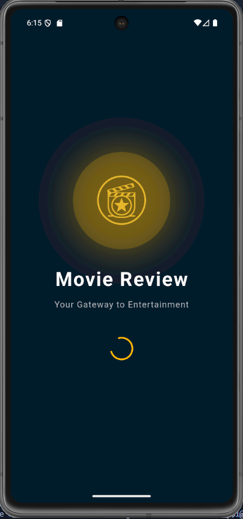
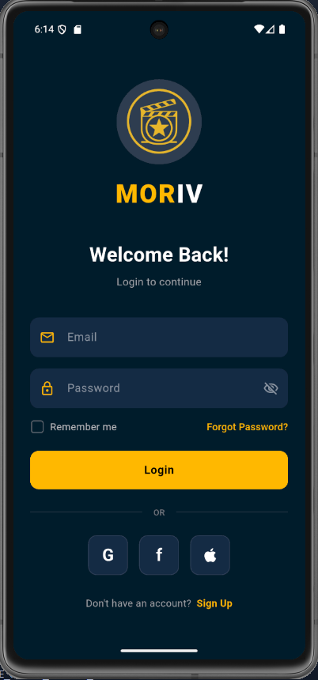
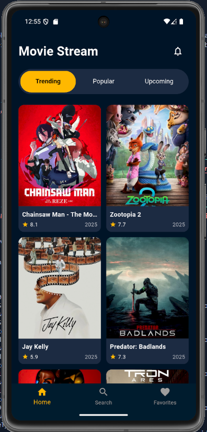
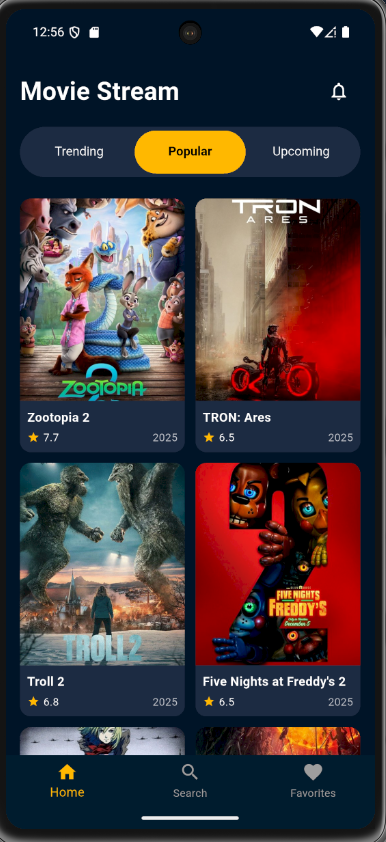
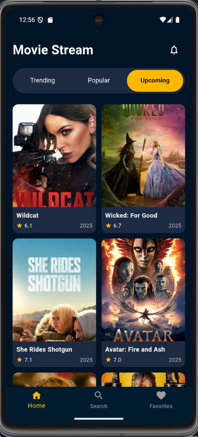
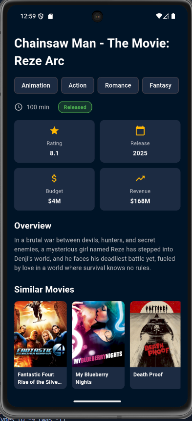

**🎬 Flutter Movie Review App**

Aplikasi Movie Review adalah aplikasi mobile berbasis Flutter yang menampilkan katalog film dari The Movie Database (TMDB). Aplikasi ini memungkinkan pengguna untuk menjelajahi film trending, popular, upcoming, mencari film, melihat detail lengkap termasuk trailer YouTube, dan menyimpan film favorit.

**🎬 Preview**

Authentication Flow
|               Splash              |              Login             |  
| :-------------------------------: | :---------------------------: | 
|  |  | 


Main Features
|               Home - Trending             |               Home - Popular              |               Home - Upcoming             |
| :-------------------------------: | :---------------------------: | :-------------------------------: |
|  |  |  | 

Search, Detail, & Favorites
|               Search             |               Movie Detail              |               Similar Movies             |               Favorites            |
| :-------------------------------: | :---------------------------: | :-------------------------------: | :-------------------------------: |
|  |  |  |  | 


**🚀 Fitur Utama**

✨ Fitur Utama
🔐 Authentication

✅ Splash Screen dengan animasi loading
✅ Login Page dengan form validasi
✅ Password visibility toggle
✅ Remember me checkbox
✅ Social login buttons (Google, Facebook, Apple)

🏠 Home Page

✅ Tab Navigation: Trending, Popular, Upcoming movies
✅ Grid layout dengan movie cards
✅ Real-time data dari TMDB API
✅ Pull to refresh
✅ Loading & error states

🔍 Search

✅ Real-time search dengan debouncing
✅ Search movies by title
✅ Display search results dengan poster & info
✅ Empty state handling

🎥 Movie Detail

✅ Comprehensive movie information:

Title, tagline, overview
Release date, runtime, status
Budget & revenue
Rating (vote_average)
Genres

✅ Backdrop & poster images dari TMDB CDN
✅ YouTube trailer integration (buka di external app)
✅ Similar movies recommendation
✅ Add/Remove to favorites
✅ Share functionality

⭐ Favorites

✅ Persistent storage dengan SharedPreferences
✅ Add/Remove favorites
✅ Grid view layout
✅ Clear all favorites
✅ Undo remove feature
✅ Empty state with CTA

🛡️ Error Handling

✅ 3-State Management: Loading, Success, Error
✅ Network error handling
✅ Retry functionality
✅ Empty state messages
✅ Graceful degradation

**🧩 Project Structure**
```
📦 movie_review_app/
├── 📂 assets/
│   ├── 📂 data/
│   │   └── 📜 movies.json              # Dummy data (tidak digunakan lagi)
│   └── 📂 images/
│       └── 📜 logo.png                 # App logo
│
├── 📂 lib/
│   ├── 📜 main.dart                    # Entry point
│   │
│   ├── 📂 config/
│   │   └── 📜 api_config.dart          # API configuration & endpoints
│   │
│   ├── 📂 models/
│   │   ├── 📜 movie.dart               # Movie model
│   │   └── 📜 movie_detail.dart        # Movie detail & video models
│   │
│   ├── 📂 services/
│   │   └── 📜 movie_service.dart       # HTTP service (API calls)
│   │
│   ├── 📂 providers/
│   │   ├── 📜 movie_provider.dart      # Movie state management
│   │   └── 📜 favorite_provider.dart   # Favorites state management
│   │
│   ├── 📂 routes/
│   │   ├── 📜 app_routes.dart          # Route constants
│   │   └── 📜 route_generator.dart     # Route generator
│   │
│   ├── 📂 pages/
│   │   ├── 📜 splash_page.dart         # Splash screen
│   │   ├── 📜 login_page.dart          # Login page
│   │   ├── 📜 main_page.dart           # Bottom navigation
│   │   ├── 📜 home_page.dart           # Home with tabs
│   │   ├── 📜 search_page.dart         # Search functionality
│   │   ├── 📜 movie_detail_page.dart   # Movie details
│   │   └── 📜 favorites_page.dart      # Favorites list
│   │
│   └── 📂 widgets/
│       ├── 📜 movie_card.dart          # Movie card component
│       └── 📜 info_card.dart           # Info card component
│
├── 📂 screenshots/                      # App screenshots
├── 📜 pubspec.yaml                      # Dependencies
└── 📜 README.md                         # This file
```

**🧠 Teknologi yang Digunakan**

Core Technologies

Framework: Flutter 3.x

Language: Dart 3.x

Architecture: Clean Architecture with Provider

API: The Movie Database (TMDB) REST API

**🧪 Testing**

Manual Testing

Untuk testing manual, ikuti skenario berikut:

**Test 1: Data Loading (Internet ON)**

Pastikan device terhubung internet

Buka aplikasi

Verifikasi data film muncul di Home page

Navigate ke tab Popular & Upcoming

Verifikasi data termuat

**Test 2: Error Handling (Internet OFF)**

Tutup aplikasi

Matikan WiFi/Data

Buka aplikasi

Verifikasi error message muncul

Klik "Retry"

Verifikasi tetap error

Nyalakan internet

Klik "Retry" lagi

Verifikasi data muncul

**Test 3: Search Functionality**

Klik tab Search

Ketik "Spiderman"

Verifikasi hasil search muncul

Ketik kata random

Verifikasi empty state muncul

**Test 4: Favorites**

Buka movie detail

Klik icon favorite

Navigate ke tab Favorites

Verifikasi movie tersimpan

Tutup & buka app lagi

Verifikasi data favorites persistent

**🐛 Known Issues**


Trailer button akan membuka browser/YouTube app (tidak embedded player)

Social login buttons di login page belum terintegrasi (UI only)

Similar movies terbatas 10 film

**📄 License**

This project is created for educational purposes (UAS Project).

**⚙️ Cara Menjalankan Proyek**

Clone repository ini
``` git clone https://github.com/<username>/flutter_movie_app.git ```

Masuk ke direktori proyek
``` cd flutter_movie_app ```

Install dependencies
``` flutter pub get ```

Jalankan aplikasi
``` flutter run```

**🧑‍💻 Author**

Faruq Faroiz Maulidiarsyah [2306051101179]

📧 [faruqfaroiz@gmail.com]

**🙏 Acknowledgments**

TMDB API - untuk menyediakan data film gratis

Flutter Team - untuk framework yang amazing

Provider Package - untuk state management solution
