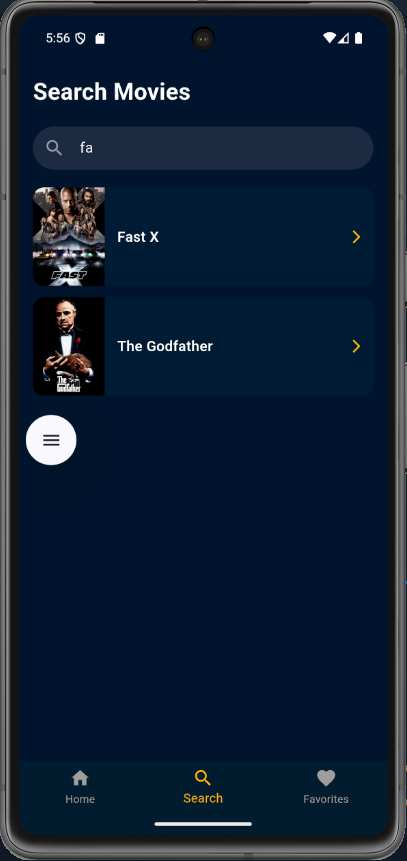

**🎬 Flutter Movie Review App**
Aplikasi Flutter Movie Review App adalah aplikasi katalog film sederhana yang dibuat menggunakan Flutter dan Dart.
Aplikasi ini memungkinkan pengguna untuk menjelajahi daftar film, melihat detail film, melakukan pencarian, dan menampilkan halaman favorit (masih dalam tahap pengembangan).

**🎬 Preview**
|               Splash              |              Home             |               Detail              |               Search              |
| :-------------------------------: | :---------------------------: | :-------------------------------: | :-------------------------------: |
|  |  |  |  |


**⚠️ Catatan:**
Semua data film dalam aplikasi ini masih bersifat dummy (belum terhubung ke API atau database asli).
Fitur Favorites Page dan Trailer saat ini belum berfungsi sepenuhnya dan akan dikembangkan di versi berikutnya.

**🚀 Fitur Utama**
Splash Screen — tampilan pembuka aplikasi sebelum masuk ke halaman utama.
Login Page — halaman login sederhana untuk masuk ke aplikasi.
Home Page — menampilkan daftar film populer dan rekomendasi.
Search Page — memungkinkan pengguna mencari film berdasarkan judul.
Movie Detail Page — menampilkan detail film seperti judul, rating, durasi, dan deskripsi.
Favorites Page (masih dummy) — rencana untuk menyimpan film favorit pengguna.
Trailer Preview (belum berfungsi) — tombol untuk menampilkan trailer film.

**🧩 Project Structure**
## 📁 Project Structure ``` project-root/ │ ├── assets/ │ ├── data/ │ │ └── movies.json │ │ │ └── images/ │ └── logo.png │ └── lib/ ├── data/ │ └── movie_data.dart │ ├── models/ │ └── movie.dart │ ├── pages/ │ ├── favorites_page.dart │ ├── home_page.dart │ ├── login_page.dart │ ├── main_page.dart │ ├── movie_detail_page.dart │ ├── search_page.dart │ └── splash_page.dart │ ├── widgets/ │ ├── info_card.dart │ └── movie_card.dart │ └── main.dart ``` ##


 🧠 Teknologi yang Digunakan
Framework: Flutter
Bahasa: Dart
Desain UI: Material Design Components
Sumber Data: File lokal movie_data.dart (dummy JSON-like data)
